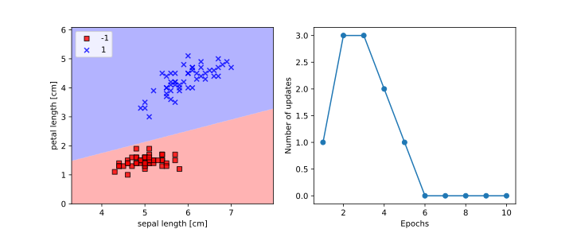

# PML
Python Machine Learning

Machine Learning KLibrary built using examples from the Python machine Learning book written by 
Sebastion Raschka and Vahid Mirjalili (Published by Packt)

Library is meant to be used with Anaconda, python >= 3.6

example using Perceptron and plot_decision_regions():

